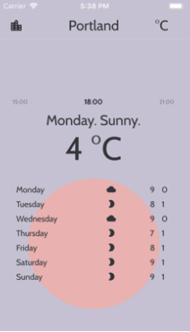
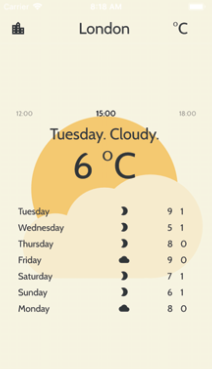
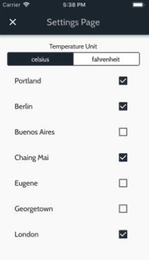

# A flutter app built for learning purpose
## This is an Android app I made following some tutorials and a book to learn how Flutter works.

You can download it into your computer, and run it with the command: flutter run. Make sure that you have the flutter SDK installed and a virtual device connected (can be from android studio).

Features include:
- users can scroll up and down to view temperatures throughout the day
- can select different cities
- can toggle between celsius and fahrenheit
- the background changes according to the weather conditions (ex. a raining day will show a cloud and rain, sunny day will be a sun), and lighting will change according to the time of the day (dark during the night, and bright during the day)
- the temperatures and cities are hard-coded. For future improvement, they should be retrieved from an API endpoint

Here are some screen captures of the app. 

  
  
  
  

