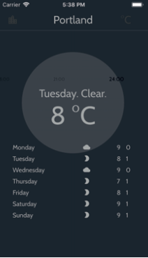

# A flutter app built for learning purpose
## This is an app I made following some tutorials and books to learn Flutter how it works.

Here are some demos of the app. You can download it into your computer, and run it with the command: flutter run. Make sure that you have the flutter SDK installed and a virtual device connected (can be from android studio).

  
  
  
  

